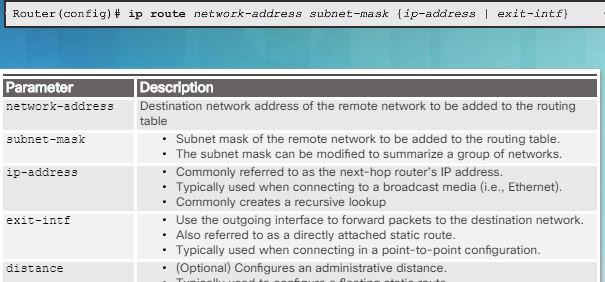
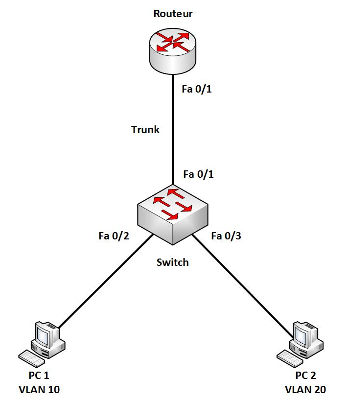
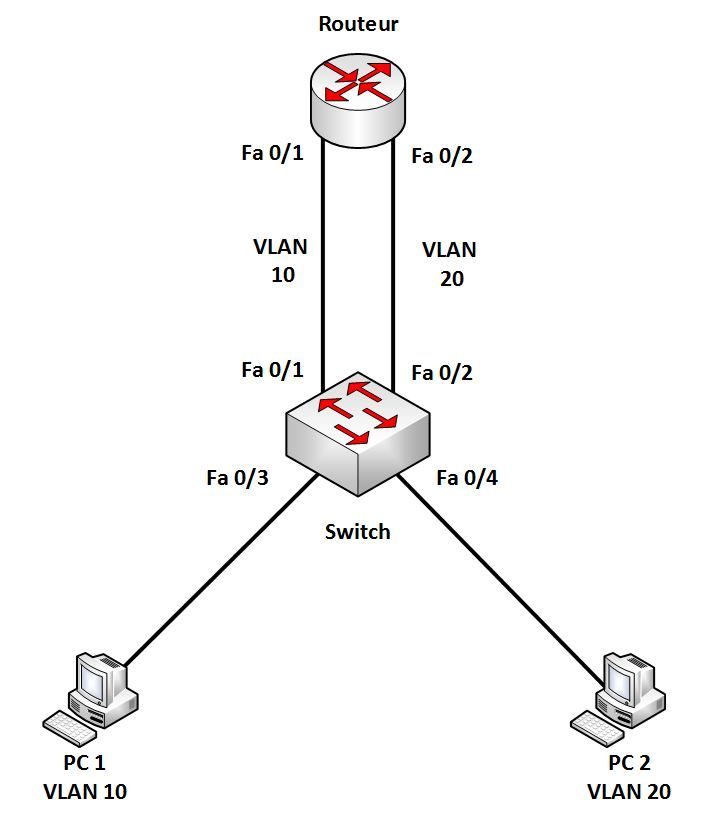
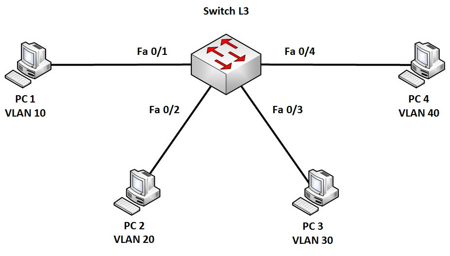

*UE3 Prosit 3 - Principe de routage*

# Mots Clés
- ROMMON
- Boot
- Inter VLAN
- Routeur
- Routage
- Bootstrap

# Besoins
**Quoi** : Comprendre le problème du routeur.
**Comment** : En reconfigurant le routeur.
**Pourquoi** : Routeur ne boot pas.

# Contraintes
- Prendre en compte le routage inter VLAN
- Utilisation d'un routeur Cisco 1841

# Problématique
- Comment configurer un routeur en prenant en compte le routage inter VLAN ?
- Comment boot un routeur ?

# Généralisation
- MCO

# Hypothèse
- Il n'y a pas de bouton reboot sur un routeur / switch.
- Un routeur inter VLAN permet faire communiquer plusieurs VLAN entre eux.
- L'image IOS n'est pas présente dans le routeur.
- Affichage d'une image IOS présent dans la ROM.
- image peut-être récupérée sur le réseau ou sur un périphérique bootable.

# Plan d'action
## Etudes
### Boot d'un routeur

1 . POST (dans la ROM)

power on self test, diagnostique du hardware (CPU, RAM, NVRAM)

2 . Bootstrap (dans la ROM):

après le POST le bootstrap est copié de la ROM vers la RAM, le but du bootstrap est de trouver l'IOS et le charger dans la RAM

3 . Chargement du Cisco IOS : il est généralement dans la flash, mais si on ne le trouve pas dans la flash, le routeur le cherche sur un TFTP, si il ne trouve toujours pas d'IOS il copie l'IOS limité dans la RAM qui permet d'effectuer un diagnostique et copier un version complète dans la flash

4 . Chargement de la startup-config  : le bootstrap copie ensuite la startup config de la NVRAM vers la RAM. Si il ne la trouve pas dans la NVRAM on peut le config pour la chercher sur un TFTP. Si il ne trouve pas de tftp le routeur affiche l'invite du mode configuration

### Principe de routage

	show ip route
	show ipv6 route
	show ip route static
	
config des routes statiques

	R1(config)#ip route 192.168.2.0 255.255.255.0 192.168.3.2
	R1(config)#ipv6 route 2001:db8:1ab:2::/64 g0/2 fe80::2
et pour suppr la route on met no devant

routage statique

Dans le routage statique, les administrateurs vont configurer les routeurs un à un au sein du réseau afin d'y saisir les routes (par l'intermédiaire de port de sortie ou d'IP de destination) à emprunter pour aller sur un réseau donné

il existe l'équivalent pour IPv6

	R1(config)#ip route 192.168.2.0 255.255.255.0 192.168.3.2
	R1(config)#ipv6 route 2001:db8:1ab:2::/64 g0/2 fe80::2

Avantages :

Économie de bande passante : Étant donné qu'aucune information ne transitent entre les routeurs pour qu'ils se tiennent à jour, la bande passante n'est pas encombrée avec des messages d'information et de routage.
Sécurité : Contrairement aux protocoles de routage dynamique que nous allons voir plus bas, le routage statique ne diffuse pas d'information sur le réseau puisque les informations de routage sont directement saisies de manière définitive dans la configuration par l'administrateur.
Connaissance du chemin à l'avance : L'administrateur ayant configuré l'ensemble de la topologie saura exactement par où passent les paquets pour aller d'un réseau à un autre, cela peut donc faciliter la compréhension d'un incident sur le réseau lors des transmissions de paquets.

Inconvénients :

La configuration de réseaux de taille importante peut devenir assez longue et complexe, il faut en effet connaitre l'intégralité de la topologie pour saisir les informations de manière exhaustive et correcte pour que les réseaux communiquent entre eux. Cela peut devenir une source d'erreur et de complexité supplémentaire quand la taille du réseau grandit.
A chaque fois que le réseau évolue, il faut que chaque routeur soit au courant de l'évolution par une mise à jour manuelle de la par de l'administrateur qui doit modifier les routes selon l'évolution.

conclusion : le routage statique est intéressant uniquement sur les petits réseaux avec peu de routeurs et d'évolutions 

routage dynamique

Le routage dynamique permet de se mettre à jour automatiquement. Un protocole de routage permet aux routeurs d'échanger des informations de façon périodique ou événementielles pour s'informer de l'évolution du réseau. 

avantages

Une maintenance réduite par l'automatisation des échanges et des décisions de routage
Une modularité et une flexibilité accrue, il est plus facile de faire évoluer le réseau avec un réseau qui se met à jour automatiquement.
Sa performance et sa mise en place ne dépendent pas de la taille du réseau

inconvénients :

l peut être plus compliqué à mettre en place lors de son initialisation
Il consomme de la bande passante de par les messages que les routeurs s'envoient périodiquement sur le réseau
La diffusion automatique de message sur le réseau peut constituer un problème de sécurité car un attaquant peut obtenir des informations sur la topologie du réseau simplement en écoutant et en lisant ces messages d'information du protocole de routage et même en créer afin de se faire passer pour un membre du réseau.
Le traitement des messages réseau et le calcul des meilleures routes à emprunter représentent une consommation de CPU et de RAM supplémentaire qui peut encombrer certains éléments du réseau peu robuste.

### Routage inter VLAN

Il est possible de faire communiquer 2 VLAN sans compromettre leur sécurité. On peut brancher un des switches à un routeur, on appelle cela un Router on a stick , mais on pourrait également utiliser un switch de niveau 3.

On peut assigner plusieurs VLAN à un même port physique du routeur en la découpant en interfaces virtuelles 

Config:

démarrer l'interface du routeur

	Router>enable
	Router#configuration terminal
	Router(config)#interface fa0/0
	Router(config-if)#no shutdown 
	Router(config-if)#exit

On découpe ensuite en interface virtuelles

Router(config)#interface fa0/0.1

on active ensuite l'encapsulation dot1Q qui indique que les trames ont un flag contenant les VLAN source et de destination

	Router(config-subif)#encapsulation dot1Q 20 
permet d'encapsuler une trame pour transiter sur le VLAN 20 

avantage du router on a stick :  1 seul port nécessaire pour communiquer entre le switch et le routeur
inconvénient : on à un goulot d'étranglement puisque tout le trafic inter VLAN passent par un seul lien

autre solution : on peut utilisier un port par VLAN les performances sont alors améliorées mais ne fonctionne que pour les très petites architectures 

utiliser un switch de niveau 3:

un switch de niveau 3 est un switch capable d'effectuer du routing, il ne remplace cependant pas un routeur qui dispose de fonctions supplémentaires 

avantage: pouvoir utiliser 1 port par vlan, réduisant la latence à un coût faible par rapport à un routeur mais le prix d'un switch l3 est élevé par rapport à un l2. Note: on place généralement les switches L3 aux niveaux Distribution et Core 

config:

activer le routing 
	
	Switch-1(config)#ip routing

config EIGRP sur un switch L3

	Switch-1(config)#router eigrp 1
	Switch-1(config-router)#no auto-summary
	Switch-1(config-router)# network 10.0.0.0 0.0.255.255

# Réalisations
- Reconfigurer le routeur
- Utiliser du routage static
